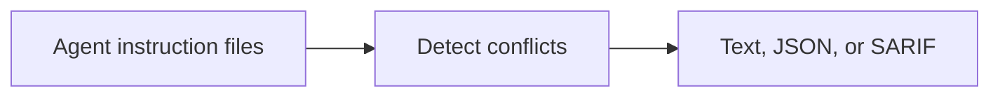

<!-- readme-refresh:start -->
<p align="center">
  <picture>
    <source media="(prefers-color-scheme: dark)" srcset="assets/readme-banner.png">
    <source media="(prefers-color-scheme: light)" srcset="assets/readme-banner.png">
    
  </picture>
</p>

<h1 align="center">🧭 Agent Rule Conflicts</h1>

<p align="center"><strong>Detect contradictory coding-agent instructions before they reach your agents.</strong></p>

<p align="center">
  <a href="https://github.com/al1re3a/agent-rule-conflicts/actions/workflows/ci.yml"></a>
  <a href="https://www.python.org/"></a>
  <a href="LICENSE"></a>
  <a href="https://github.com/al1re3a/agent-rule-conflicts/releases"></a>
  <a href="https://github.com/al1re3a/agent-rule-conflicts/stargazers"></a>
  <a href="https://github.com/al1re3a/agent-rule-conflicts/issues"></a>
</p>

<p align="center">
  <a href="https://github.com/al1re3a/agent-rule-conflicts"></a>
  <a href="#quick-start"></a>
  <a href="CONTRIBUTING.md"></a>
  <a href="SECURITY.md"></a>
</p>

<p align="center">
  
</p>

> [!NOTE]
> The scanner is offline and deterministic. Its results are focused on explicit English requirements and prohibitions; review the documented detection scope before enforcing it in CI.

## 📑 Contents

- [At a glance](#-at-a-glance)
- [Why this exists](#why-this-exists)
- [Quick start](#quick-start)
- [Supported instruction files](#supported-instruction-files)
- [Output formats](#output-formats)
- [GitHub Actions](#github-actions)
- [Detection model](#detection-model)

---

## 🔎 At a glance

| | |
|---|---|
| **Purpose** | Detect contradictory AI coding-agent instructions before they reach your agents — offline, deterministic, SARIF-ready. |
| **Input** | Agent instruction files |
| **Output** | Text, JSON, or SARIF |
| **Runtime** | Python 3.10+ |
| **CI** | ✅ Linux |
| **Status** | ✅ Maintained |

<details>
<summary><strong>🧭 How it works</strong></summary>



</details>

<details>
<summary><strong>📁 Repository layout</strong></summary>

```text
agent-rule-conflicts/
├── .github/
├── src/
├── tests/
├── examples/
├── docs/
├── pyproject.toml
├── action.yml
└── README.md
```

</details>

<details>
<summary><strong>🤝 Contributors</strong></summary>

<br>
<a href="https://github.com/al1re3a/agent-rule-conflicts/graphs/contributors">
  
</a>

</details>
<!-- readme-refresh:end -->

An `AGENTS.md` says “always run `pytest`.” A nested `CLAUDE.md` says
“never run `pytest`.” Both look reasonable in isolation; together they make agent
behavior unpredictable. Agent Rule Conflicts finds that collision locally and in
CI with no network calls and no LLM dependency.

```text
CLAUDE.md:12: error ARC001 (high confidence) Conflicting instructions for: pytest
  deny: Never run `pytest` before committing.
  require: Always run `pytest` before committing. [AGENTS.md:8]
Scanned 2 file(s), extracted 14 directive(s), found 1 conflict(s).
```

## Why this exists

Modern repositories often carry instructions for several coding agents. Those
files evolve independently, inherit through directories, and are easy to review
one at a time. This tool adds one deterministic preflight check across the whole
instruction surface.

- Finds supported rule files recursively while ignoring dependency and build trees.
- Extracts explicit English requirements and prohibitions outside code fences.
- Matches contradictory actions and commands across files or within one file.
- Reports both locations, the original text, and a confidence level.
- Emits text for humans, JSON for automation, and SARIF 2.1.0 for code scanning.
- Runs offline with zero runtime dependencies.

## Quick start

Install directly from GitHub with `pipx`:

```bash
pipx install git+https://github.com/al1re3a/agent-rule-conflicts.git
agent-rule-conflicts .
```

Or run from a clone:

```bash
git clone https://github.com/al1re3a/agent-rule-conflicts.git
cd agent-rule-conflicts
python -m pip install -e .
agent-rule-conflicts examples/conflicting --fail-on never
```

The default exit code is `1` when a high-confidence conflict is found, `0` when
the check passes, and `2` for a usage or I/O error.

## Supported instruction files

- `AGENTS.md`, `CLAUDE.md`, `CODEX.md`, `GEMINI.md`, and `SKILL.md`
- `.github/copilot-instructions.md`
- `.github/instructions/*.instructions.md`
- `.cursor/rules/*.md` and `.cursor/rules/*.mdc`
- `.claude/rules/*.md`

Common generated, dependency, test, example, virtual-environment, and vendor
directories are excluded from repository-wide discovery. Point the CLI directly
at an excluded directory when you intentionally want to scan it.

## Output formats

```bash
# Human-readable output
agent-rule-conflicts .

# Structured report for another tool
agent-rule-conflicts . --format json --output reports/conflicts.json

# GitHub Code Scanning-compatible output
agent-rule-conflicts . --format sarif --output reports/conflicts.sarif

# Audit without failing a build
agent-rule-conflicts . --fail-on never
```

`--fail-on` accepts `high` (the default), `any`, or `never`.

## GitHub Actions

Use the repository as a composite action:

```yaml
name: Agent instruction audit

on:
  pull_request:

permissions:
  contents: read

jobs:
  agent-rules:
    runs-on: ubuntu-latest
    steps:
      - uses: actions/checkout@v4
      - uses: actions/setup-python@v5
        with:
          python-version: "3.12"
      - uses: al1re3a/agent-rule-conflicts@v0.1.0
        with:
          fail-on: high
```

For the strongest supply-chain guarantee, pin the full commit SHA instead of a
movable tag.

## Detection model

The scanner deliberately starts with explainable signals:

1. It extracts lines containing an explicit modal such as `must`, `always`,
   `never`, `do not`, `avoid`, `required`, `should`, or `prefer`.
2. It classifies each line as a requirement or prohibition.
3. It normalizes inline commands and action terms.
4. It compares opposite-polarity directives and reports sufficiently similar pairs.

Fenced examples, headings, and YAML frontmatter are ignored. Reports include the
original lines so every result is reviewable without trusting a model-generated
explanation.

## Scope and limitations

Version 0.1 focuses on explicit English directives. It does not attempt to prove
that two natural-language policies are logically equivalent, fully model each
agent's directory-inheritance semantics, or guarantee that a repository is safe.
Scope qualifiers such as “for frontend files only” can require human review.

The goal is a fast, deterministic signal with useful locations—not a security
oracle. False-positive and false-negative reports with small public fixtures are
welcome.

## Development

```bash
python -m pip install -e .
python -m unittest discover -s tests -v
python -m agent_rule_conflicts examples/conflicting --fail-on never
```

The test suite covers discovery, Markdown parsing, conflict matching, exit-code
behavior, JSON, text, and SARIF output. See [CONTRIBUTING.md](CONTRIBUTING.md) for
the contribution workflow and [SECURITY.md](SECURITY.md) for private reporting.

## Roadmap

- Directory-aware effective-scope analysis
- Configurable vocabulary and ignore rules
- Baselines for gradual adoption in existing monorepos
- More natural-language test fixtures and additional instruction formats

## License

MIT © 2026 al1re3a
